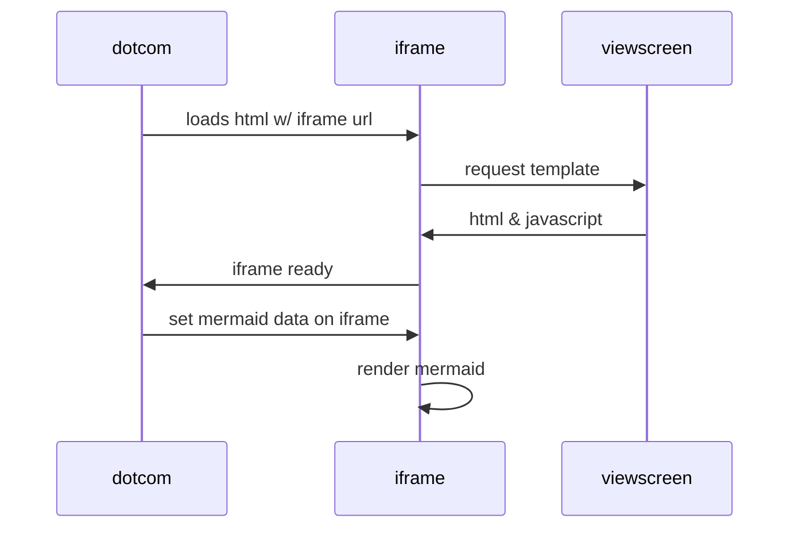

# SLR - Symbolic Execution Limitations

Please check [how to contribute](https://github.com/mximp/se-limitations-slr).  
Assessment summary can be found [here](/assessment-list.md).

## Current stats

## Updates

  <h3>{{ post.date | date: "%Y, %b %d" }}: <a href="{{ post.url | prepend: site.baseurl }}">{{ post.title }}</a></h3>
  {{ post.excerpt }}
  


